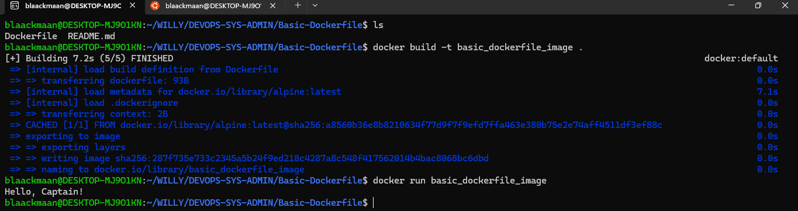

The goal of this project is to write a basic Dockerfile to create a Docker image.
When this Docker image is run, it should print “Hello, Captain!” to the console before exiting.

## REQUIREMENTS
    
The Dockerfile should be named Dockerfile. 
The Dockerfile should be in the root directory of the project. 
The base image should be alpine:latest. 
The Dockerfile should contain a single instruction to print “Hello, Captain!” to the console before exiting. 

## HOW TO TEST

Once your Dockerfile is written, run the command to have your customized docker image.

    docker build -t basic_dockerfile_image .

Then create a container based on your customized docker image.

    docker run basic_dockerfile_image

You will see the message "Hello, Captain!" displayed in your terminal.

