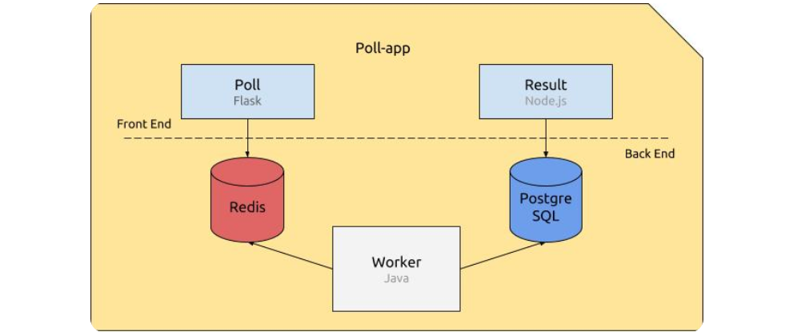

## POPEYE 
<p align="center">
  
</p>

Popeye is a project that aims to introduce you to the basics of docker and docker compose.
The goal of the project is to containerize and deploy a simple web application.

The web application works a bit like this:

✓ Poll (Flask/Python): A web interface that allows users to vote.<br>
✓ Redis (Temporary database): Stores votes before they are processed.<br>
✓ Worker (Java/Maven): Retrieves votes from Redis and saves them in PostgreSQL.<br>
✓ PostgreSQL (Persistent database): Stores votes permanently.<br>
✓ Result (Node.js): A web interface that displays the results of the votes.<br>



The different codes are provided to you in the pool, result and worker folders.

## CONFIGURATION 

The pool, worker and result elements must be configured using specific environment variables described below:

`Poll`

✓ REDIS_HOST: the hostname of the Redis service to connect to.

`Result`

✓ POSTGRES_HOST: the hostname of the database service to connect to. <br>
✓ POSTGRES_PORT: the port the database service is listening on. <br>
✓ POSTGRES_DB: the name of the PostgreSQL database to connect to. <br>
✓ POSTGRES_USER: the user that will be used to connect to the database.<br>
✓ POSTGRES_PASSWORD: the password of the user that will be used to connect to the database.<br>

`Worker`

The Worker uses the same environment variables as both Poll and Result.<br>

## DOCKER IMAGES

You have to create 3 images.
The specifications for each image are as described below.

`Poll`

- [x] The image must be based on a Python official image.
- [x] The dependencies of the application can be installed using the following command:
- [x] pip3 install -r requirements.txt
- [x] The application must expose and run on the port 80, and can be started with:
- [x] flask run --host=0.0.0.0 --port=80

`Result`

- [x] The image must be based on an official Node.js version 20 Alpine image.
- [x] The application must expose and run on the port 80.
- [x] The dependencies of the application can be installed using the following command:
- [x] npm install

`Worker`

The image will be built using a multi-stage build.

<u> First stage - compilation </u>

- [x] The first stage must be based on maven:3.9.6-eclipse-temurin-21-alpine and be named builder.
- [x] It must be used to build (of course) and package the Worker application using the following
commands: <br>
    - mvn dependency:resolve, from within the directory containing pom.xml;<br>
    - then, mvn package, from within the directory containing the src directory.<br>

It generates a file in the target directory named worker-jar-with-dependencies.jar (relative to your
WORKDIR).

<u> Second stage - run </u>

- [x] The second stage must be based on eclipse-temurin:21-jre-alpine.
- [x] This is the one really running the worker using the command:<br>
    - java -jar worker-jar-with-dependencies.jar

## DOCKER COMPOSE 

You now have 3 Dockerfiles that create 3 isolated images.
It is now time to make them all work together using Docker Compose!

Create a docker-compose.yml file that will be responsible for running and linking your containers.
Your Docker Compose file should contain 5 services:<br>

✓ <u> poll </u> <br>
– builds your poll image;<br>
– redirects port 5000 of the host to the port 80 of the container.<br>
– correctly sets the necessary environment variable.<br>

✓ <u> redis </u> <br>
– uses an existing official image of Redis 7;<br>
– opens port 6379.<br>

✓ <u> worker </u> <br>
– builds your worker image;<br>
– correctly sets the same environment variables as both the poll and result services.<br>

✓ <u> db </u> <br>
– represents the database that will be used by the apps;<br>
– uses an existing official image of PostgreSQL 16;<br>
– has its database schema created during container first start;<br>
– correctly sets the appropriate environment variables.<br>

✓ <u> result </u> <br>
– builds your result image;<br>
– redirects port 5001 of the host to the port 80 of the container;<br>
– correctly sets the necessary environment variables.<br>

Databases must be launched before the services that use them, because these services
are depending on them.

<u> 3 networks</u> <br>
✓ poll-tier to allow poll to communicate with redis.<br>
✓ result-tier to allow result to communicate with db.<br>
✓ back-tier to allow worker to communicate with redis and db.<br>

You must use networks. Using the links property is forbidden.

<u> 1 named volume </u> <br>
✓ db-data which allows the database’s data to be persistent, if the container dies.<br>
The path of data in the official PostgreSQL image is documented on Docker Hub.

## HOW TO TEST 

Once your docker-compose.yml is complete, you should be able to run all the services and access the
different web pages:<br>

In the terminal, go to the project folder and run:

    ```
    docker compose up -d 
    ```
Once launched, you can:

✓ Poll at http://localhost:5000; <br>
✓ and Result at http://localhost:5001. <br>
You should be able to vote on Poll’s page and see its effect on Result’s page.
Your containers must restart automatically when they stop unexpectedly.
